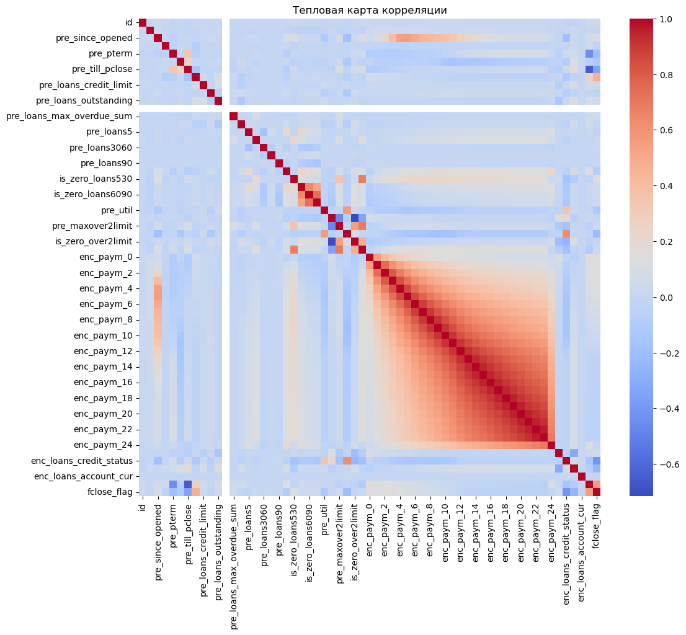
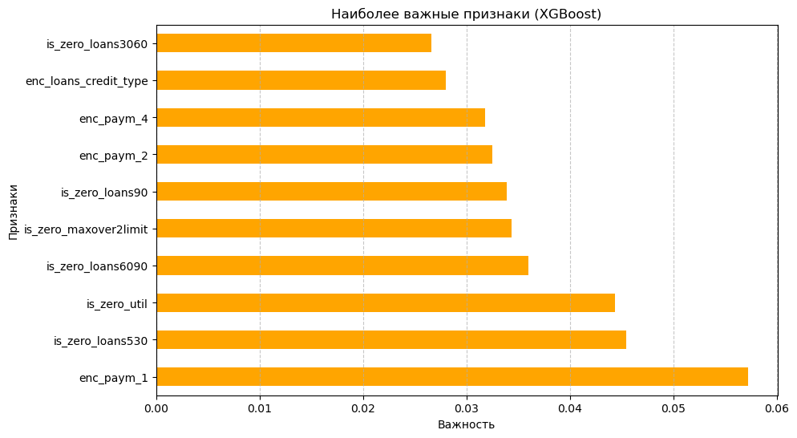

# Credit Scoring Classifier

This project implements a supervised learning approach to estimate credit default risk based on a dataset containing demographic and financial attributes of clients. The aim is to train a binary classifier capable of distinguishing between clients who are likely to repay and those at risk of default.

## Project Structure

```bash
credit-scoring-classifier/
├── notebooks/
│   └── credit_scoring_model.ipynb          # Main Jupyter notebook with Full ML pipeline
├── data/
│   ├── train.pq                            # Labeled training dataset
│   ├── test.pq                             # Test dataset without labels
│   └── credit_scoring_predictions.csv      # Final predictions (submission file)
├── README.md                               # Project overview
├── requirements.txt                        # Dependencies
└── .gitignore                              # Files ignored by Git
```

## Dataset Description

The dataset contains features such as:
- Client demographics
- Income and employment information
- Loan application details
- Previous credit history

The target variable indicates whether a client defaulted on credit (`1`) or not (`0`).

## Objective

To build a binary classifier that predicts default risk based on the given training data, and generate predictions for the unlabeled test set.

## Workflow

- Load and clean the data (Parquet format)
- Exploratory Data Analysis (EDA)
- Feature encoding and scaling
- Model training (RandomForest, CatBoost, etc.)
- Evaluation using accuracy and AUC
- Final predictions and CSV submission

## Key Results 
### Correlation Heatmap


A correlation heatmap was generated to visualize the relationships between numerical features. This helps identify:
- Strongly correlated variables (e.g. duplicate or redundant features)
- Features that are potentially most predictive of the target variable

This step is crucial in the **feature selection phase** to improve model performance and avoid multicollinearity.

## Model Performance:


XGBoost (lowered threshold): Precision: 0.0662, Recall: 0.3946, Accuracy: 0.8111, AUC-ROC: 0.6674

## Submission Format

The final CSV file must include:
- `ID`
- `prediction` (class label: 0 or 1)

## Installation

```bash
pip install -r requirements.txt
jupyter notebook notebooks/credit_scoring_model.ipynb
```

Author
Zarina Sakhipova
